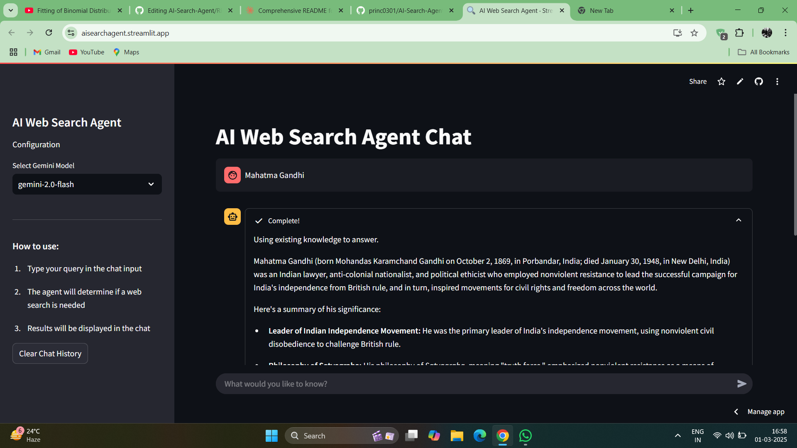

# AI Web Search Agent 🔍

An intelligent search agent that leverages large language models to perform web searches, extract relevant information, and provide accurate responses. This tool enhances AI capabilities by accessing up-to-date information from the web.

## Features

- **Intelligent Query Generation**: Automatically creates optimal search queries based on user input
- **Web Scraping**: Extracts and processes information from websites using DuckDuckGo search
- **Relevance Analysis**: Evaluates search results to find the most useful information
- **Multiple Model Support**: Works with both Groq (Llama3, Mixtral) and Google's Gemini models
- **Interactive UI**: Built with Streamlit for a clean, user-friendly experience
- **Command Line Interface**: Standalone mode for terminal usage

## Demo



## Architecture

The application follows this workflow:

1. **Query Analysis**: Determines if a web search is needed for the user's question
2. **Search Query Generation**: Creates an optimized search query
3. **Web Search**: Performs a DuckDuckGo search to find relevant information
4. **Result Analysis**: Selects the most promising search result
5. **Content Extraction**: Scrapes and parses the selected webpage
6. **Relevance Verification**: Confirms if the extracted content contains the needed information
7. **Response Generation**: Uses the LLM to craft a response based on retrieved information

## Installation

### Prerequisites

- Python 3.8+
- API keys for either Groq or Google Gemini

### Setup

1. Clone the repository:
   ```bash
   git clone https://github.com/princ0301/AI-Search-Agent.git
   cd AI-Search-Agent
   ```

2. Install dependencies:
   ```bash
   pip install -r requirements.txt
   ```

3. Create a `.env` file in the project root and add your API keys:
   ```
   GROQ_API_KEY = "your_groq_api_key"
   GEMINI_API_KEY = "your_gemini_api_key"
   MODEL = "llama3-70b-8192"  # or your preferred model
   ```

## Usage

### Web Interface (Streamlit)

Run either the Groq-based or Gemini-based web application:

```bash
# For Groq models
python app.py

# For Gemini models
streamlit run gemini_app.py
```

Open your browser at http://localhost:8501 to use the application.

### Command Line Interface

For terminal-based usage:

```bash
python main.py
```

## Configuration

### Available Models

#### Groq Models
- `llama3-70b-8192`
- `mixtral-8x7b-32768`

#### Gemini Models
- `gemini-2.0-flash`
- `gemini-1.5-pro`

You can select your preferred model in the sidebar of the web interface or by modifying the `.env` file for the command-line version.

## System Components

-  `gemini_app.py`: Main Streamlit applications
- `main.py`: Command-line interface
- `sys_msgs.py`: System prompts for LLM orchestration
- `requirements.txt`: Project dependencies

## Contributing

Contributions are welcome! Please feel free to submit a Pull Request.

1. Fork the repository
2. Create your feature branch (`git checkout -b feature/amazing-feature`)
3. Commit your changes (`git commit -m 'Add some amazing feature'`)
4. Push to the branch (`git push origin feature/amazing-feature`)
5. Open a Pull Request

## License

This project is licensed under the MIT License - see the LICENSE file for details.

## Acknowledgments

- [Trafilatura](https://github.com/adbar/trafilatura) for web scraping
- [BeautifulSoup](https://www.crummy.com/software/BeautifulSoup/) for HTML parsing
- [Streamlit](https://streamlit.io/) for the web interface
- [Groq](https://groq.com/) and [Google Gemini](https://ai.google.dev/) for LLM APIs
